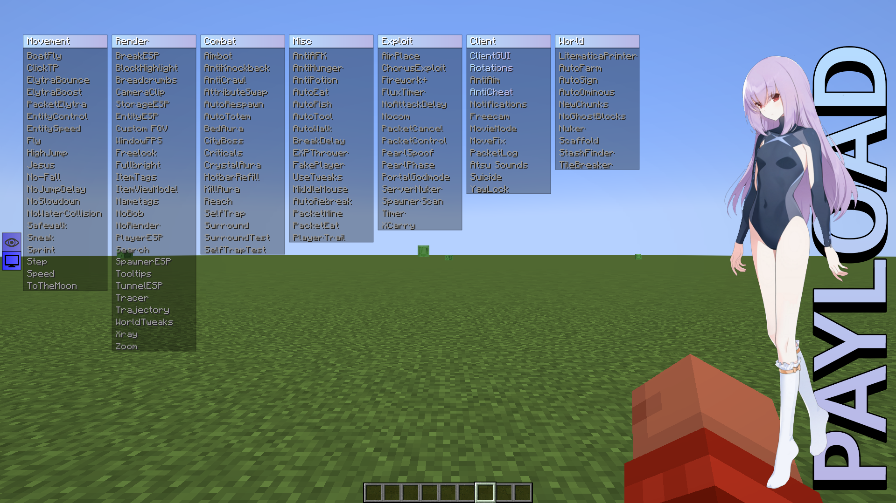

<h1 align="center">Payload 💉</h1>

## About
Payload is a 1.21.4 Minecraft Utility Mod made for Anarchy Servers such as 2b2t and Constantiam. It was developed with the intention to be sold as a budget friendly client, but the developer quit the project and released the source code to last public build to me. Notably this client has working scaffold, elytra fly, and other features for both Constantiam and 2b2t.

## Modules
1. LitematicaPrinter
2. ClientGUI
3. Rotations
4. AirPlace
5. Aimbot
6. AntiAFK
7. AntiAim
8. AntiCheat
9. AntiHunger
10. AntiKnockback
11. AntiPotion
12. AntiCrawl
13. AttributeSwap
14. AutoEat
15. AutoFarm
16. AutoFish
17. AutoRespawn
18. AutoSign
19. AutoOminous
20. AutoTotem
21. AutoTool
22. AutoWalk
23. BedAura
24. BoatFly
25. BreakESP
26. BlockHighlight
27. Breadcrumbs
28. BreakDelay
29. CameraClip
30. ChestESP
31. ChorusExploit
32. ClickTP
33. Notifications
34. CityBoss
35. Criticals
36. CrystalAura
37. ElytraBounce
38. ElytraBoost
39. ElytraPacket
40. EntityControl
41. EntityESP
42. EntitySpeed
43. EXPThrower
44. FakePlayer
45. FireworkPlus
46. Fly
47. FluxTimer
48. Fov
49. WindowFPS
50. Freecam
51. Freelook
52. Fullbright
53. HotbarRefill
54. HighJump
55. InteractTweaks
56. ItemTags
57. ItemViewModel
58. Jesus
59. KillAura
60. MovieMode
61. MiddleMouse
62. Nametags
63. NewChunks
64. NoBob
65. NoAttackDelay
66. NoFall
67. NoGhostBlocks
68. NoJumpDelay
69. Nocom
70. NoRender
71. NoSlowdown
72. NoWaterCollision
73. MoveFix
74. Nuker
75. PacketCancel
76. PacketControl
77. InstantRebreak
78. PacketMine
79. PacketEat
80. PacketLog
81. PearlSpoof
82. PearlPhase
83. PlayerESP
84. PlayerTrail
85. PortalGod
86. Reach
87. Safewalk
88. Says
89. Search
90. Scaffold
91. Sneak
92. SpawnerESP
93. ServerNuker
94. SpawnerScan
95. Sprint
96. Step
97. Speed
98. StashFinder
99. SelfTrap
100. Suicide
101. Surround
102. SurroundTest
103. SelfTrapTest
104. TileBreaker
105. Timer
106. Tooltips
107. ToTheMoon
108. TunnelESP
109. Tracer
110. Trajectory
111. WorldTweaks
112. XCarry
113. XRay
114. YawLock
115. Zoom

## License
This project is licensed under the GNU General Public License v3.0. See the [LICENSE.md](LICENSE.md) file for details.

## Contact
This is no longer supported by the original developer. I am solely reuploading the source code.
